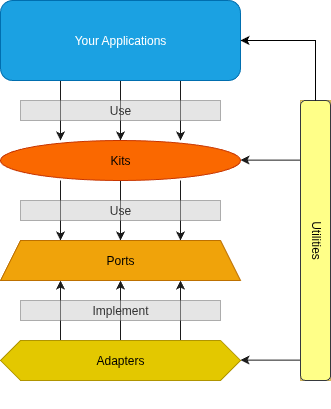

# Welcome to Portico

Portico is a Python framework that gives you the building blocks to create AI-powered applications that don't turn into spaghetti code as they grow.

## What is Portico?

Think of Portico as a set of well-tested, production-ready components for the stuff every AI app needs: authentication, databases, LLM integrations, caching, file storage, and more. But instead of just handing you a pile of code, Portico enforces a clean architecture that keeps your application maintainable as it scales from MVP to production.

The secret? **Hexagonal architecture** (also called "ports and adapters"). Sounds fancy, but the idea is simple: your business logic shouldn't care whether you're using OpenAI or Anthropic, PostgreSQL or SQLite, Redis or in-memory caching. You should be able to swap these out without rewriting your entire application.

<div align="center">
  
</div>

## The Four Building Blocks

Portico organizes code into four clear layers. Once you understand these, everything else clicks into place:

### 1. **Kits** - Your Business Logic

Kits are where your application logic lives. Think of them as services that do the actual work of your application:

- `AuthKit` - Login, logout, session management
- `UserKit` - User creation, updates, profiles
- `LLMKit` - Talking to AI models
- `RAGKit` - Retrieval-augmented generation
- `CacheKit` - Smart caching strategies

**The key rule:** Kits never import specific implementations. They only depend on **ports** (interfaces). This means your business logic stays clean and testable.

```python
# Kits depend on interfaces, not implementations
class LLMKit:
    def __init__(self, llm_provider: LLMProvider):  # Interface, not OpenAI or Anthropic
        self.provider = llm_provider

    async def generate(self, prompt: str) -> str:
        return await self.provider.complete(prompt)
```

### 2. **Ports** - The Contracts

Ports are interfaces (using Python's `ABC` or `Protocol`) that define *what* your application needs, without saying *how* it should work.

```python
class LLMProvider(ABC):
    @abstractmethod
    async def complete(self, prompt: str) -> str:
        """Generate a completion for the given prompt."""
        pass
```

That's it. Just a contract. The kit uses this interface, and adapters implement it.

**Why this matters:** Your business logic (`LLMKit`) has no idea if it's talking to OpenAI, Anthropic, or a local model. It just knows it can call `.complete()` and get a response.

### 3. **Adapters** - The Implementations

Adapters are the concrete implementations of ports. This is where you integrate with external services:

- `OpenAIProvider` - Implements `LLMProvider` using OpenAI's API
- `AnthropicProvider` - Implements `LLMProvider` using Anthropic's API
- `PostgresRepository` - Implements database repositories with PostgreSQL
- `RedisCacheAdapter` - Implements caching with Redis

```python
class OpenAIProvider(LLMProvider):
    def __init__(self, api_key: str):
        self.client = OpenAI(api_key=api_key)

    async def complete(self, prompt: str) -> str:
        response = await self.client.completions.create(
            model="gpt-4",
            messages=[{"role": "user", "content": prompt}]
        )
        return response.choices[0].message.content
```

**The magic:** Swap `OpenAIProvider` for `AnthropicProvider` and your entire app just works with a different AI provider. No changes to business logic needed.

### 4. **Compose** - Wiring It All Together

The `compose` module is the only place in Portico that imports adapters. This is your "composition root" - where you decide which concrete implementations to use.

```python
from portico import compose

# Define your stack
app = compose.webapp(
    auth=compose.auth(),
    user=compose.user(),
    llm=compose.llm(provider="openai", api_key="..."),
    cache=compose.cache(adapter="redis", url="..."),
    database=compose.database(adapter="postgres", url="...")
)

# Use it in your routes
@app.route("/generate")
async def generate(request):
    result = await app.llm.generate(request.prompt)
    return {"result": result}
```

---

Ready to dive in? Check out the [philosophy](philosophy.md) to understand the design principles, or explore the [example applications](https://github.com/yourusername/portico-examples) to see Portico in action.
